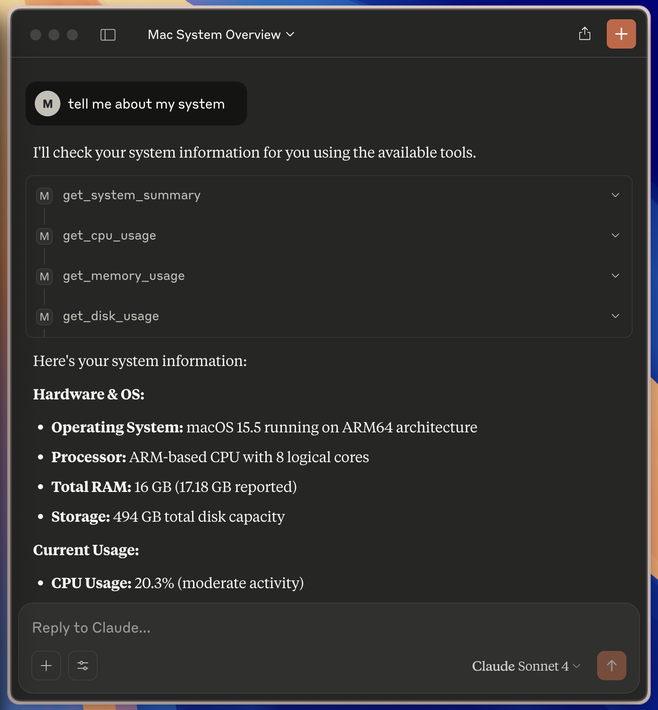
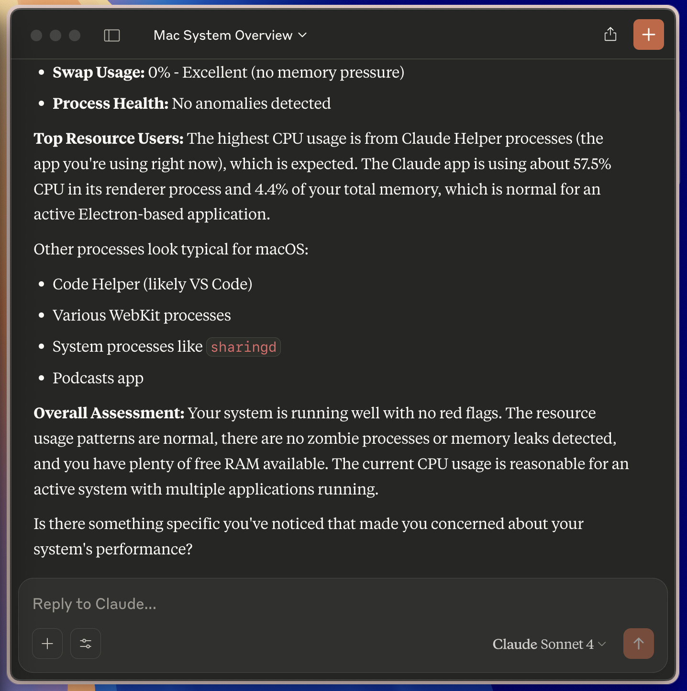
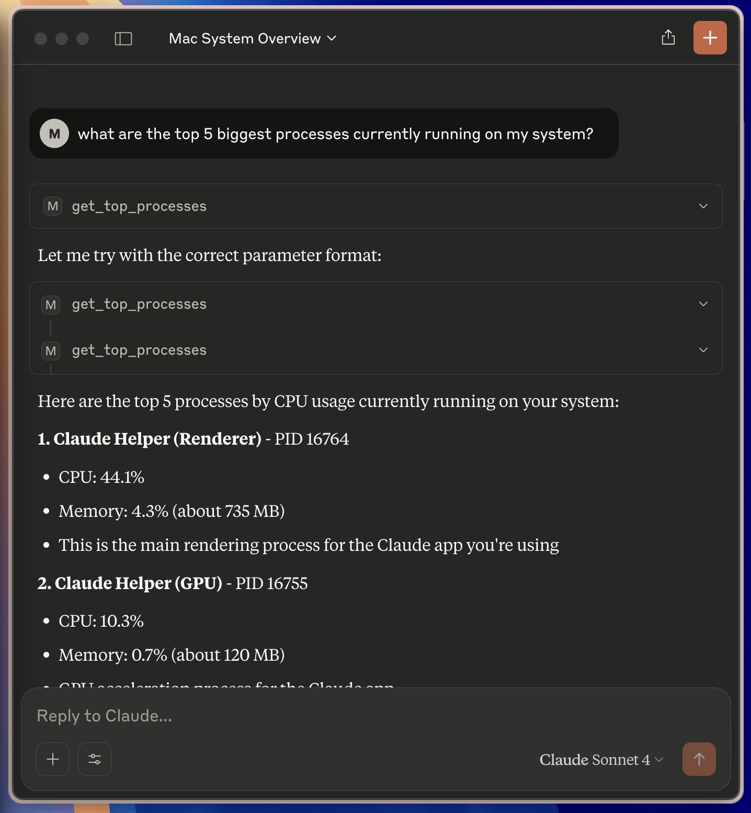

# 🧠 Local Process Intelligence MCP Server
This is a local, intelligent monitoring server built for the [Model Context Protocol (MCP)](https://docs.anthropic.com/en/docs/mcp). It provides deep insight into your system and running processes, enabling a local LLM agent to analyze the machine’s state, perform diagnostics, suggest optimizations, and offer real-time solutions.



> [!NOTE]
> ### ⚙️ Compatibility
> This project was tested on the latest versions of **macOS**. While most features work reliably on this version, compatibility with other operating systems (Linux/Windows) is not guaranteed.

## What It Can Do
This project provides tools to:
- 🔧 Retrieve a full system summary (OS, CPU, RAM, Disk, Boot Time)
- 📊 Monitor CPU usage in real time
- 💾 Track RAM and swap memory usage
- 💽 Check disk usage (total, used, free, % used)
- 🧩 Analyze top processes sorted by CPU load
- 🔎 Search for running processes by name
- 🌲 Explore the process tree of a given PID
- ⚠️ Detect anomalies like:
- High memory + low CPU (e.g., memory leaks)
- Zombie/defunct processes
- Resource usage spikes above a threshold
- 🧠 Deliver actionable warnings and insights

This allows a local agent to not only observe, but also understand what’s happening on your machine — and provide real-time, specific solutions based on the actual system state.




## 🚀 Quick Start
### 📦 Installation
It is recommended using [uv](https://github.com/astral-sh/uv), so make sure you have **uv** installed. Generally, for more information regarding MCP checkout [MCP Python SDK](https://github.com/modelcontextprotocol/python-sdk).

Clone this repo then:
```bash
uv sync
```

### ▶️ Running the Server / Adding to Claude Desktop Config
With uv:
```bash
uv run mcp install main.py
```
Or directly:
```bash
mcp install main.py
```
To test in development mode with logging:
```bash
mcp dev main.py
```
> [!NOTE]
> 🧠 Note: When using Claude Desktop, ensure the app is properly restarted after installing a new server.
>
> Find more information on [MCP Quickstart](https://modelcontextprotocol.io/quickstart/user)

## 🚧 Future Work
The project lays the foundation for a powerful local system intelligence layer. In future versions, one could:
- Expand full cross-platform support
- Add background process logging
- Integrate energy usage and thermal monitoring
- Allow custom alert thresholds and scheduled diagnostics
- Let agents make automated corrective actions
